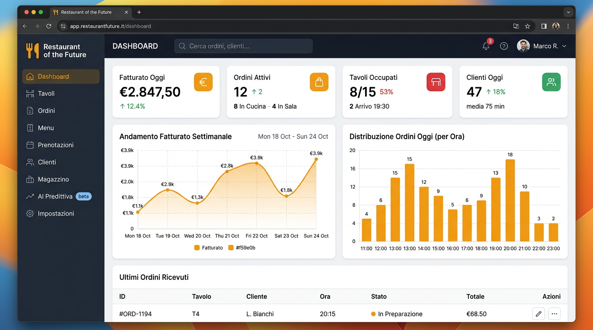
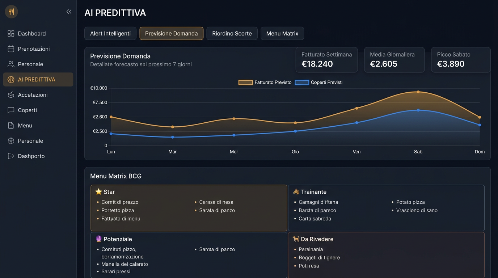
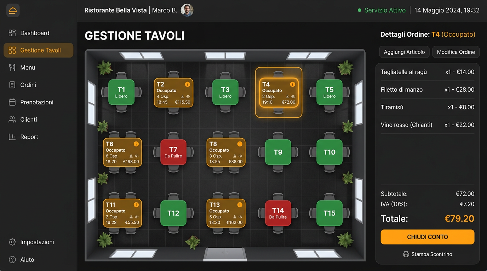

# 🍽️ Restaurant of the Future

> **Full-stack SaaS gestionale per ristoranti** — POS, cucina real-time, CRM, magazzino, marketing e AI predittiva in un'unica piattaforma.

[](https://www.typescriptlang.org/)
[](https://react.dev/)
[](https://nodejs.org/)
[](https://www.prisma.io/)
[](./LICENSE)

---

## ✨ Panoramica

**Restaurant of the Future** risolve i 7 problemi critici che ogni ristoratore affronta quotidianamente:

| Problema | Soluzione |
|---|---|
| 6-7 app separate che non comunicano | Piattaforma all-in-one |
| Commissioni delivery 25-30% | Menu QR con ordine e pagamento diretto |
| Sprechi alimentari | AI predittiva con riordino automatico |
| No-show alle prenotazioni | Caparra online con Stripe |
| Zero ownership clienti | CRM proprietario con marketing automation |
| Nessuna visibilità P&L | Report finanziari in tempo reale |
| Gestione manuale cucina | Kitchen Display System real-time |

---

## 📸 Screenshot

### Dashboard — KPI e grafici in tempo reale


### AI Predittiva — Previsione domanda e Menu Matrix BCG


### Gestione Tavoli — Mappa interattiva e POS


---

## 🏗️ Architettura

```
restaurant-of-the-future/
├── backend/                 # API Node.js + Express + TypeScript
│   ├── prisma/
│   │   └── schema.prisma    # Schema DB (15+ modelli)
│   └── src/
│       ├── routes/          # 15 moduli API REST
│       │   ├── auth.ts
│       │   ├── orders.ts
│       │   ├── menu.ts
│       │   ├── tables.ts
│       │   ├── reservations.ts
│       │   ├── customers.ts
│       │   ├── inventory.ts
│       │   ├── staff.ts
│       │   ├── analytics.ts
│       │   ├── loyalty.ts
│       │   ├── marketing.ts
│       │   ├── reports.ts
│       │   ├── waitlist.ts
│       │   ├── payments.ts
│       │   └── ai.ts        # ← AI predittiva
│       ├── middleware/       # Auth JWT + error handling
│       ├── socket/           # WebSocket handlers
│       └── lib/              # Prisma client, Stripe
├── frontend/                # React + Vite + TypeScript
│   └── src/
│       ├── pages/           # 18 pagine complete
│       ├── components/      # Componenti riutilizzabili
│       ├── contexts/        # Auth + Socket context
│       └── lib/             # API client, utilities
└── landing/
    └── index.html           # Landing page standalone
```

---

## 🚀 Stack Tecnologico

### Backend
| Tecnologia | Uso |
|---|---|
| **Node.js 24 + TypeScript** | Runtime e linguaggio |
| **Express.js** | Framework HTTP |
| **Prisma ORM** | Database ORM + migrations |
| **SQLite** (dev) / PostgreSQL (prod) | Database |
| **Socket.io** | WebSocket real-time |
| **JWT + bcryptjs** | Autenticazione |
| **Zod** | Validazione input |
| **Stripe** | Pagamenti online |

### Frontend
| Tecnologia | Uso |
|---|---|
| **React 19 + TypeScript** | Framework UI |
| **Vite** | Build tool |
| **Tailwind CSS** | Styling utility-first |
| **React Query (TanStack)** | Server state management |
| **React Router v6** | Routing SPA |
| **Socket.io-client** | Real-time updates |
| **Recharts** | Grafici e visualizzazioni |
| **Radix UI + Lucide** | Componenti e icone |

---

## 📦 Moduli Implementati

### Fase 1 — MVP
- ✅ **Dashboard** — KPI in tempo reale, grafici fatturato
- ✅ **POS & Tavoli** — Mappa interattiva, presa comande touch
- ✅ **Gestione Ordini** — Stati multipli, modifica real-time
- ✅ **Menu Digitale** — Categorie, disponibilità, featured
- ✅ **Prenotazioni** — Slot intelligenti, conferme, note
- ✅ **CRM Clienti** — Storico, allergie, preferenze
- ✅ **Magazzino** — Alert scorte, fornitori, categorie
- ✅ **Personale & Turni** — Pianificazione, timbrature
- ✅ **Autenticazione** — JWT, ruoli (Owner/Manager/Waiter/Kitchen)

### Fase 2 — Growth
- ✅ **Kitchen Display System** — Schermo cucina real-time, timer, notifiche
- ✅ **Menu QR Pubblico** — Clienti ordinano dal telefono
- ✅ **WebSocket** — Aggiornamenti live su tutti i dispositivi
- ✅ **Analytics** — Grafici avanzati, trend, performance

### Fase 3 — Intelligence
- ✅ **Programma Fedeltà** — Livelli VIP, punti, cashback automatico
- ✅ **Marketing Automation** — Campagne email/SMS, compleanno, win-back
- ✅ **Report P&L** — Fatturato, food cost, margini, trend annuale
- ✅ **Waitlist** — Lista d'attesa prenotazioni

### Fase 4 — Enterprise
- ✅ **Pagamenti Stripe** — Checkout dal menu QR, caparra prenotazioni
- ✅ **AI Predittiva** — 4 motori: previsione domanda, riordino, menu matrix, alert
- 🔜 Multi-ristorante / SaaS
- 🔜 Fatturazione elettronica

---

## 🤖 AI Predittiva (zero API esterne)

Tutti gli algoritmi girano sui dati storici del ristorante, in locale:

```
┌─────────────────────────────────────────────────────┐
│  GET /api/ai/forecast     → Previsione 7 giorni     │
│  GET /api/ai/reorder      → Suggerimenti riordino   │
│  GET /api/ai/menu-matrix  → Classificazione BCG     │
│  GET /api/ai/alerts       → Alert intelligenti      │
│  GET /api/ai/summary      → Widget dashboard        │
└─────────────────────────────────────────────────────┘
```

**Menu Matrix BCG:** classifica ogni piatto in:
- ⭐ **Star** — Alto volume + alto margine → mantieni in stock
- 🐴 **Trainante** — Alto volume + basso margine → aumenta prezzo
- 🔮 **Potenziale** — Basso volume + alto margine → promuovi
- 🐕 **Da rivedere** — Basso volume + basso margine → considera rimozione

---

## ⚙️ Installazione locale

### Prerequisiti
- Node.js 18+
- npm 9+

### Setup

```bash
# 1. Clona il repository
git clone https://github.com/TUO-USERNAME/restaurant-of-the-future.git
cd restaurant-of-the-future

# 2. Backend
cd backend
npm install
cp .env.example .env
# Modifica .env con i tuoi valori

# 3. Database
npx prisma db push
npx tsx src/seed.ts    # Carica dati demo

# 4. Frontend (nuovo terminale)
cd ../frontend
npm install
cp .env.example .env

# 5. Avvia tutto
cd ..
.\avvia-app.ps1        # Windows
```

### Credenziali demo
| Campo | Valore |
|---|---|
| Email | `admin@demo.it` |
| Password | `admin123` |

---

## 🗄️ Schema Database

```
Restaurant ──┬── User (ruoli: Owner/Manager/Waiter/Kitchen/Cashier)
             ├── Table (tavoli con mappa e QR code)
             ├── MenuCategory ── MenuItem
             ├── Order ──────── OrderItem
             ├── Reservation
             ├── Customer ───── LoyaltyTransaction
             ├── LoyaltyTier
             ├── Campaign
             ├── WaitlistEntry
             ├── InventoryItem ── InventoryItemLink
             ├── Shift
             └── RestaurantSettings
```

---

## 📁 Struttura API

```
POST   /api/auth/login
POST   /api/auth/register

GET    /api/analytics/dashboard
GET    /api/analytics/charts

GET    /api/ai/forecast
GET    /api/ai/reorder
GET    /api/ai/menu-matrix
GET    /api/ai/alerts

GET    /api/menu/categories
POST   /api/menu/items
PATCH  /api/menu/items/:id/availability

POST   /api/orders/public          ← senza auth (menu QR)
GET    /api/orders
PATCH  /api/orders/:id/status

POST   /api/payments/checkout      ← Stripe checkout
POST   /api/payments/webhook       ← Stripe webhook
GET    /api/payments/overview

GET    /api/loyalty/tiers
POST   /api/loyalty/transactions/earn

GET    /api/reports/monthly
GET    /api/reports/food-cost
```

---

## 👩‍💻 Autrice

**Elena Trambusti**
- Email: [elenatrambusti2024@gmail.com](mailto:elenatrambusti2024@gmail.com)
- LinkedIn: *[aggiungi il tuo profilo]*
- GitHub: *[aggiungi il tuo username]*

---

## 📄 Licenza

Software proprietario — © 2026 Elena Trambusti. Tutti i diritti riservati.
Vedere [LICENSE](./LICENSE) per i dettagli completi.
Il codice è visibile a scopo di portfolio. È vietato l'uso commerciale senza autorizzazione scritta.
